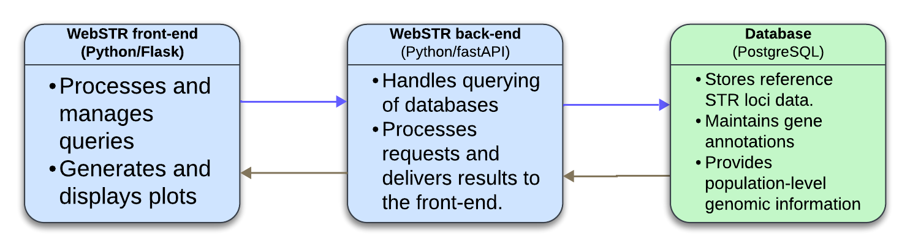
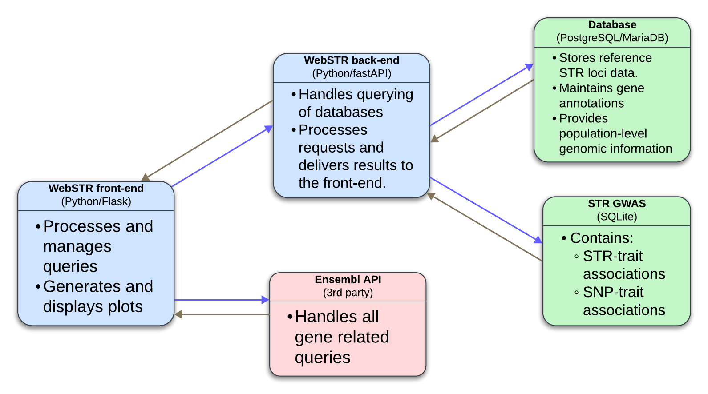
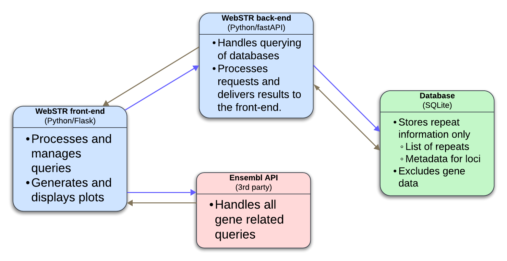
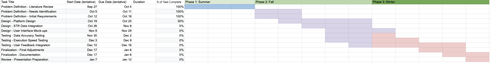

# Introduction

#### Need

Short Tandem Repeats (STRs) are highly variable genetic sequences that play crucial roles in gene regulation, disease susceptibility, and phenotypic diversity. Despite their significance, STRs remain underutilized in genome-wide association studies (GWAS), which predominantly focus on single nucleotide polymorphisms (SNPs). Integrating STRs into GWAS provides a more nuanced view of genetic variation, potentially uncovering causal variants missed by SNP-based approaches. However, current tools for STR-trait analysis are static, human-centric, and fail to accommodate the dynamic needs of modern genomics research.

This project addresses a critical gap: the lack of a robust platform to dynamically analyze STR-trait associations across species. Addressing this need will benefit a range of stakeholders:

|**Stakeholder**|**Size Estimate**|**Specific Needs**|
|---|---|---|
|Genomics and bioinformatics researchers|~10,000 worldwide|Require dynamic, interactive tools to explore STR-trait associations with precision, replacing outdated, static visualizations.|
|Genetic researchers and clinicians|~15,000 worldwide|Need access to current fine-mapping and association data to identify genetic variants and advance personalized medicine approaches.|
|Patients with complex genetic disorders|Millions globally|Benefit from improved diagnostic tools and tailored treatments informed by STR data integration into GWAS.|
|Ethnically diverse populations|Global population focus|Stand to gain equity in genomic research outcomes as STR data addresses gaps left by SNP-focused studies, highlighting underrepresented genetic diversity.|

#### Problem Statement

The WebSTR platform currently lacks interactive visualizations, multi-species capabilities, and integration of fine-mapped STR-trait association data. These limitations impede researchers' ability to fully leverage STRs as complementary tools to SNPs for understanding genetic variation. Key challenges include:

## Figure 1: Current WebSTR Architecture

*Figure 1: Current WebSTR architecture highlighting its static visualization tools, human-centric focus, and limited database scalability. This illustrates the limitations of the existing platform, which lacks dynamic visualizations, multi-species support, and efficient data handling.*

1. **Dynamic Visualizations**  
    Existing STR visualization tools rely on static plots, limiting researchers' ability to perform in-depth analyses. The project must deliver interactive tools, such as Manhattan and locus-specific regression plots, for real-time exploration.
    
2. **Cross-Species Data Integration**  
    WebSTR is limited to human STRs, excluding valuable insights from comparative genomic studies. Incorporating STR data from species like mice and rats will broaden its utility for translational research.
    
3. **Optimized Database and Interface Design**  
    The current architecture must be streamlined to handle larger datasets with improved accuracy and efficiency. Migrating gene annotations to Ensembl’s API and adopting SQLite will simplify database management and enhance performance.
    
4. **Equity in Genomic Research**  
    Traditional GWAS methodologies often fail to capture genetic diversity across populations. Incorporating STR data into WebSTR will reduce bias and foster equitable research outcomes.
    

#### Specific Aims

To address these challenges, this project will:

1. **Develop Interactive Visualizations**  
    Implement dynamic Manhattan and conditional regression plots to enhance STR-trait exploration and support hypothesis generation.
    
2. **Expand Multi-Species Capabilities**  
    Integrate STR datasets for mice and rats, leveraging Ensembl’s API for gene annotations. This cross-species approach will facilitate comparative genomic studies and translational research.
    
3. **Redesign the Database Architecture**  
    Transition WebSTR’s backend to a simpler SQLite schema to support faster queries, scalable data integration, and reliable updates for multi-genome datasets.
    
4. **Facilitate Personalized Medicine and Equity**  
    Empower researchers and clinicians to identify individual genetic contributions to diseases, enabling personalized treatments and reducing disparities in genomic research outcomes.
    

#### Practical Applications

The enhanced WebSTR platform will drive advancements in:

- **Disease Research**: By integrating STR-trait associations, researchers can uncover genetic underpinnings of complex diseases such as cancer and neurodegenerative disorders.
- **Drug Development**: Dynamic STR data can support fine-mapping for therapeutic targets, expediting the identification of candidate genes and pathways for drug discovery.
- **Personalized Medicine**: Incorporating STR data into GWAS will refine patient stratification, tailoring treatments based on genetic profiles.

# Background

#### Scientific and Technology Background

**Short Tandem Repeats (STRs): Biological Significance**  
Short Tandem Repeats (STRs) are repetitive DNA sequences, typically 1–6 base pairs in length, constituting about 3% of the human genome.1 STRs play critical roles in genetic variation, influencing gene expression, protein synthesis, and regulatory mechanisms. Notably, STRs exhibit high mutation rates, ranging from 10−610^{-6} to 10−210^{-2} per generation, far exceeding the 10−910^{-9} mutation rate observed in unique DNA sequences.2 These elevated rates contribute to frameshift mutations, influencing gene regulation and potentially leading to phenotypic diversity or disease. The most agreed-upon method of this heightened mutation rate is strand-slippage during replication. During DNA replication, if a mispairing between strands happens, then the repeated DNA fragment loops out. When synthesis continues, the repeat number of STR is changed.

It has been found that tandem repeat polymorphisms (TRPs) can regulate gene expression in healthy individuals. 3STR variability has been implicated in a spectrum of disorders, including Huntington’s disease, which arises from expansions of CAG repeats.4 5 The severity and onset of Huntington's disease inversely correlate with repeat length, emphasizing the clinical relevance of STR mutations. Beyond monogenic disorders, STRs influence polygenic traits, as demonstrated in studies linking STRs to blood phenotypes and other complex traits. A 2023 study set out to identify STR-trait associations in 44 blood phenotypes.6 Researchers found that STRs contribute greatly to complex traits, demonstrating the need for improved understanding of the field.

**STRs in Bioinformatics**  
Technological advancements have enabled large-scale STR analysis, providing insights into their functional roles. Tools like WebSTR catalog population-wide STR variations, while platforms such as STRetch detect pathogenic expansions.7 8 These computational approaches have broadened our understanding of STR-related genetic variation and their contributions to disease.

#### State of the Art

**Challenges in STR Integration**  
Despite their significance, STRs remain underrepresented in genome-wide association studies (GWAS). Traditional GWAS primarily focus on single nucleotide polymorphisms (SNPs), which limits the identification of causal variants. STRs, with their ability to mediate gene expression and impact protein function, represent a powerful yet underexplored avenue for expanding GWAS methodologies.

**Innovative Tools for STR Research**  
Current tools like WebSTR and STRetch are pivotal in advancing STR analysis. WebSTR provides a database for population-wide STR variations, supporting genomic studies by linking STR mutations to phenotypic outcomes. However, these tools are static and limited to human-centric datasets. Previous research has shown that STRs are conserved across species, suggesting their fundamental role in genome evolution. Expanding WebSTR to include multi-species STR data and integrating STR-trait associations with SNP-based insights are critical next steps in advancing the field. Additionally, the development of dynamic visualization tools, such as Manhattan plots for STR GWAS, will enable researchers to identify complex genetic interactions with unprecedented accuracy.

Combining genome and transcriptome sequencing has provided deeper insights into the functional roles of STRs, especially in relation to gene expression and disease. Using machine learning algorithms and computational pipelines allows for the analysis of larger datasets, enabling more precise identification of STR-related mutations and effects on genomic regulation. Furthermore, the technological advancements in hardware further pushes the previous limits.

**Comparative Genomics and Multi-Species STR Research**  
Comparative studies of STRs across species highlight their evolutionary significance. Cross-species analyses reveal conserved STR loci that play fundamental roles in genome stability, adaptation, and phenotypic expression. These insights not only expand our understanding of STRs in evolutionary biology but also provide translational opportunities for studying human diseases.9 10 11 Cross-species evaluation can also highlight STRs potenetiall role in evolution-driven processes, including speciation and genetic drift.

#### Patent / Intellectual Property Status

The primary focus of this project is computational innovation rather than the development of physical devices or proprietary algorithms. Existing platforms like WebSTR are publicly accessible but have significant limitations in their current implementations. While no specific patents restrict the proposed expansions, integrating STR data into GWAS frameworks must respect ethical and data-sharing policies. The reliance on open-source frameworks such as Python and SQLite ensures compliance with community standards while maintaining accessibility for researchers worldwide.

# Design Goals and Constraints

#### Functional Goals

The following goals outline the primary functional requirements for the enhanced WebSTR platform. Each goal is weighted based on its relative importance to the project’s success, with brief explanations and evaluation criteria provided.

1. **Integration with the Existing WebSTR Platform (30%)**
    
    - **Description**: The enhanced platform must seamlessly integrate with the existing WebSTR architecture. This includes ensuring compatibility with current datasets, scripts, and frameworks while avoiding disruptions to existing workflows.
    - **Importance**: Integration is critical for continuity, reducing the time and effort needed for adoption, and maintaining WebSTR's usability for current users.
    - **Evaluation Criteria**:
        - Successful migration of existing workflows and datasets.
        - Compatibility testing for database schema (SQLite) and tools like Ensembl API.
        - Minimal downtime during the transition process.
2. **Keeping Data Current (25%)**
    
    - **Description**: The platform must provide up-to-date STR-trait association data by supporting real-time or near-real-time updates from genomic datasets.
    - **Importance**: Current data ensures WebSTR remains relevant and valuable for researchers, enabling accurate and timely analyses.
    - **Evaluation Criteria**:
        - Regular data refresh rates and pipeline monitoring for delays.
        - Comparison of WebSTR data freshness with other leading tools in the field.
3. **Fast Execution Speeds (20%)**
    
    - **Description**: The platform should execute queries quickly and handle large datasets efficiently without sacrificing data accuracy.
    - **Importance**: Speed is essential for user satisfaction and maintaining relevance in competitive fields like genomics and bioinformatics.
    - **Evaluation Criteria**:
        - Measure execution times for queries of varying complexity.
        - Benchmark WebSTR against similar platforms.
4. **Reliability (15%)**
    
    - **Description**: Ensure the platform operates reliably under heavy use and provides consistent, accurate results.
    - **Importance**: Reliability builds user trust and prevents errors that could compromise research outcomes.
    - **Evaluation Criteria**:
        - System uptime monitoring and error tracking during stress tests.
        - Validation of data accuracy under different conditions.
5. **User-Friendly Interface (10%)**
    
    - **Description**: Develop an intuitive, accessible interface that encourages researchers to adopt the platform for their studies.
    - **Importance**: While secondary to technical goals, usability ensures broader adoption and maximizes the platform's impact.
    - **Evaluation Criteria**:
        - User feedback surveys during beta testing.
        - Completion rates of common tasks for new and experienced users.

#### Other Goals

- **Equity and Accessibility**
    
    - Long-term aim to incorporate STR data for underrepresented populations, enhancing genomic diversity in research.
- **Efficient Resource Use**
    
    - Reuse existing scripts, frameworks, and resources wherever possible to minimize development time and costs.

#### Constraints

The following constraints must be addressed to meet the project’s requirements:

1. **Time**
    
    - The project must be completed by the end of the academic term, leaving limited time for extensive testing and refinement.
    - Fall and early winter quarters are dedicated to making the most significant improvements.
2. **Resources**
    
    - Development relies on existing team tools and skills, including Python/Flask, FastAPI, and SQLite.
    - Testing environments are limited by the team’s remote server access.
3. **Data**
    
    - Expansion of multi-species STR datasets is limited to publicly available data sources.
    - Data pipelines must ensure compatibility with current WebSTR datasets.
4. **Regulatory Compliance**
    
    - The project must adhere to data privacy regulations (e.g., HIPAA) and university policies.
    - All external APIs, such as Ensembl, must be used within their respective terms of service.
5. **Performance Tradeoffs**
    
    - **Execution Speed vs. Data Accuracy**: Optimizing for speed may impact the accuracy of processed data, particularly with large datasets.
    - **Real-Time Updates vs. Reliability**: Full real-time data updates could slow performance or cause crashes; near-real-time updates may be a necessary compromise.
    - **Integration vs. Innovation**: Leveraging existing libraries (e.g., FastAPI) prioritizes integration but limits exploration of alternative frameworks.

# Design Alternatives and Analysis

#### Design Alternatives

**Alternative Design 1: WebSTR as a Standalone Desktop Application**  
This alternative transforms WebSTR into a desktop application, enabling offline use and leveraging personal computing power for faster execution on large datasets. A species expansion module would allow users to upload and analyze STR data for additional species locally. This approach offers flexibility for users with specific data needs and limited internet access. However, maintaining consistent updates across operating systems would be challenging. Collaboration and data sharing, particularly for species-wide research, would also be less efficient compared to a web-based model.

**Alternative Design 2: Enhanced WebSTR Web Interface with Dynamic Visualizations and Multi-Species Integration**  
This design builds on WebSTR’s web-based platform, introducing dynamic visualization features and extending its scope to include STR data for additional species, such as mice and rats. It integrates species-specific genome builds (e.g., mm10 for mice) and uses Ensembl API for gene annotation queries to streamline multi-species data handling. These enhancements maintain accessibility, collaboration, and up-to-date datasets. However, scaling the database schema to accommodate cross-species data while optimizing performance may be a challenge, requiring robust data pipeline development and testing.

**Alternative Design 3: Backend Redesign with Species-Focused Infrastructure**  
This alternative involves a complete backend redesign, transitioning to microservices to modularize species-specific functionalities. Separate databases for each species, linked through a unified query interface, would facilitate faster processing and data management. While this modular approach provides flexibility for future species additions and fine-tuning for performance, it would require significant development time and resources. Additionally, transitioning without disrupting existing functionality would be complex.

#### **Evaluation of Design Alternatives**

**Decision Matrix**

|**Goals**|**Weight (%)**|**Design 1**|**Design 2**|**Design 3**|
|---|---|---|---|---|
|Execution Speed|25|70|65|85|
|Integration with Current State|25|40|90|50|
|Multi-Species Capability|20|60|85|80|
|User-Friendliness|15|50|85|60|
|Up-to-Date Content|15|70|85|65|
|**Total Score**|**100**|**61**|**81**|**70.25**|

#### **Analysis of Results**

- **Design 2 (Enhanced WebSTR Web Interface with Dynamic Visualizations and Multi-Species Integration)** scored the highest at 81%. This design balances usability, integration, and multi-species functionality without requiring a complete system overhaul. The incorporation of Ensembl API for gene annotation ensures scalability and relevance in genomics research.
- **Design 3 (Backend Redesign with Species-Focused Infrastructure)** scored 70.25%. Although promising for scalability and long-term performance, the complexity and resources required make it less feasible within the current project timeline.
- **Design 1 (Standalone Application)** scored 61%. While offering offline capabilities, it is less user-friendly, limits collaboration, and falls short in multi-species integration, which is a critical component of this project.

## Figure 3: Comparison of Current and Planned Architecture

*Figure 3: Comparison of current and proposed WebSTR architecture, showcasing improvements in scalability, multi-species integration, and visualization tools. This side-by-side comparison highlights the added functionalities of the planned platform.*

#### **Decision and Rationale**

Design 2 is selected as the final design solution. It successfully integrates dynamic visualizations and multi-species capabilities while maintaining compatibility with the existing WebSTR framework. This ensures both immediate usability and scalability for future genomic studies.

# Design Solution

The enhanced WebSTR web interface will incorporate dynamic visualizations and support multi-species STR data analysis. By integrating Ensembl API for gene annotations and expanding the database schema to include additional species (e.g., mouse and rat), this solution addresses the needs of researchers exploring STR-trait associations across species. New features, including interactive visualizations, will improve usability while ensuring that the platform remains accessible and collaborative. This design balances innovation, integration, and scalability to meet the evolving demands of genetic research.

## Figure 2: Planned WebSTR Architecture

*Figure 2: Planned WebSTR architecture featuring modular components, multi-species support, and dynamic visualization capabilities. The enhanced architecture addresses current limitations by incorporating tools such as Manhattan plots, cross-species data integration, and a transition to SQLite.*

#### **Breakdown of the Solution into Major Subprojects**

1. **Dynamic Visualization Development**
    - **Description**: Create interactive Manhattan plots, locus plots, and genome region viewers, integrating species-specific data views.
    - **Lead**: Ciara Reeve
    - **Tasks**:
        - Develop species-specific visualization modules using tools like Plotly.
        - Ensure compatibility with genome builds (e.g., hg38, mm10).
2. **Multi-Species Data Integration**
    - **Description**: Expand WebSTR to handle STR datasets for multiple species, incorporating species-specific genome annotations via Ensembl API.
    - **Lead**: Nicholas Hubbard
    - **Tasks**:
        - Modify database schema to accommodate cross-species data.
        - Develop automated pipelines for data ingestion and annotation.
3. **User Interface Optimization**
    - **Description**: Update the interface to support species selection and comparative genomics features.
    - **Lead**: Nicholas Hubbard & Ciara Reeve
    - **Tasks**:
        - Implement dropdowns and toggles for species-specific analysis.
        - Gather user feedback to refine navigation and workflow.
4. **System Performance Optimization**
    - **Description**: Ensure responsive query handling for large cross-species datasets.
    - **Lead**: Nicholas Hubbard & Ciara Reeve
    - **Tasks**:
        - Optimize server-side computations and indexing.
        - Conduct stress testing with multi-species queries.
5. **Documentation and Training Materials**
    - **Description**: Develop resources to onboard users to the new features, focusing on multi-species data exploration.
    - **Lead**: Nicholas Hubbard & Ciara Reeve
    - **Tasks**:
        - Create species-specific analysis tutorials.
        - Provide examples of cross-species comparisons.

# Parts, Resources, Costs

#### **Software and Computational Resources**

The WebSTR project relies heavily on computational tools and open-source libraries to implement its improvements, including dynamic visualizations and multi-species integration. Below is a breakdown of the primary software resources and their associated costs.

| **Item**                                            | **Supplier/Source**       | **Purpose**                                                                        | **Cost**              |
| --------------------------------------------------- | ------------------------- | ---------------------------------------------------------------------------------- | --------------------- |
| Python Libraries (Plotly, pandas, FastAPI, etc.)    | Open Source               | Backend development, dynamic visualizations, and data processing.                  | $0 (Open Source)      |
| Ensembl API                                         | Ensembl.org               | Accessing gene annotations for human and multi-species data integration.           | $0                    |
| PostgreSQL Database                                 | Open Source               | Database management for WebSTR, scalable for multi-species data storage.           | $0                    |
| SQLite Database                                     | Open Source               | Lightweight database for STR GWAS integration and species-specific datasets.       | $0                    |
| Web Hosting                                         | SDSU Computing            | Hosting WebSTR’s web-based platform and maintaining real-time performance.         | $200/month (approx.)  |
| GitHub or GitLab (Private Repositories)             | GitHub/GitLab             | Version control and collaborative code development.                                | $0 (Educational Plan) |
| Development Environment (VS Code, Jupyter Notebook) | Open Source               | Coding and debugging.                                                              | $0                    |
| Genome Data (e.g., human, mouse, rat)               | UCSC, Ensembl, or similar | STR-related genome builds and datasets for species integration (e.g., hg38, mm10). | $0 (Open Data)        |

#### **Human and Computational Resources**

While software-based, your project requires specific resources for development, testing, and deployment.

| **Resource**                  | **Purpose**                                                                               | **Estimated Cost**       |
| ----------------------------- | ----------------------------------------------------------------------------------------- | ------------------------ |
| Remote Server Access          | For collaborative development and high-performance testing of WebSTR with large datasets. | $0 (University-Provided) |
| Research Literature Databases | Accessing relevant studies and STR datasets (e.g., PubMed, institutional library access). | $0 (Institutional)       |
| Team Time Allocation          | Dedicated hours for programming, testing, and documentation.                              | N/A                      |
| Mentor and Expert Feedback    | Guidance on project direction and validation of design choices.                           | N/A                      |

# Planning/Scheduling

#### **Potential Project Bottlenecks**

1. **Database Migration from MariaDB to SQLite**
    
    - **Challenge**: Compatibility issues during migration could arise due to syntax differences or the inability of SQLite to handle certain MariaDB-specific queries. Ensuring data integrity while transitioning datasets is critical, especially with multi-species integration.
    - **Mitigation Plan**:
        - Begin migration in phases, starting with smaller datasets.
        - Perform thorough query testing to identify and resolve any syntax mismatches.
        - Maintain a compatibility log to document and standardize query changes.
2. **Species Data Integration**
    - **Challenge**: Accessing and preparing species-specific STR datasets from various sources could be time-consuming due to differences in formatting, annotation standards, and naming conventions. Combining these datasets into a unified framework for visualization may present difficulties.
    - **Mitigation Plan**:
        - Use standardized file formats (e.g., BED, VCF) to minimize discrepancies between datasets.
        - Develop mapping pipelines for reconciling differences in annotation standards and species-specific nomenclature.
        - Plan for additional testing cycles to validate multi-species data handling and visualization.
3. **Performance with Large Datasets**
    - **Challenge**: Handling large datasets during visualization and user interaction might lead to slow loading times and excessive memory usage, impacting user experience.
    - **Mitigation Plan**:
        - Implement indexing on key fields in SQLite to optimize query speeds.
        - Use pagination and lazy-loading techniques to load only essential data at a time.
        - Reduce client-side data processing by offloading computational tasks to the server.
4. **Testing Phases**
    - **Challenge**: Testing the accuracy and performance of the platform with both human and species-specific STR datasets may take longer than anticipated, delaying final adjustments.
    - **Mitigation Plan**:
        - Start testing with small subsets of data early to identify potential issues before full-scale testing.
        - Schedule iterative user feedback sessions during development to address usability and functionality problems proactively.
        - Dedicate additional time during the testing phase for multi-species validation.
5. **Data Accessibility**
    - **Challenge**: Accessing public genomic datasets may become restricted or unavailable, limiting the project's scope.
    - **Mitigation Plan**:
        - Identify alternative data sources in advance and maintain documentation of backup options.
        - Regularly monitor data source websites for updates or changes in accessibility policies.

#### **Foreseeable Resource Setbacks and Resolutions**
1. **Access to Public Servers for Testing**
    - Resource: Testing server reliability, especially for large datasets.
    - Plan: Schedule testing phases when server loads are minimal. Ensure backup server environments are ready in case of outages.
2. **SQLite Query Optimization**
    - Resource: Efficient execution of queries on SQLite for species-specific data.
    - Plan: Implement best practices for database indexing and query optimization during early development.
3. **Timeline Constraints**
    - Resource: Limited time for final adjustments and presentation preparation.
    - Plan: Lock core functionality early in the winter quarter to allow buffer time for finalization and troubleshooting.

By identifying and planning for these bottlenecks early, the team can maintain a smoother workflow and reduce risks of delays in project milestones.

# Risk / Preliminary Assessment

#### **Risks**

The WebSTR project faces several risks across technical, resource, and user-related areas. **Technical risks** include potential delays in integrating new STR features or errors in visualization, which could result in inaccurate data representation. **Resource risks** involve possible delays in database access or computing resources, which may stall critical testing phases. Additionally, the reliance on a small team introduces the risk of burnout or progress delays if any member becomes unavailable. For end-users, **social risks** include the platform being perceived as too complex to navigate, which might limit its usability. Lastly, ensuring platform usability for researchers with diverse levels of bioinformatics expertise remains a critical challenge.

#### **Plan to Address Significant Risks**

1. **Technical Risks: Integration Issues with New STR Features**
    - **Action Plan**: Allocate extra time in the schedule for comprehensive integration testing, especially for new STR features. Maintain clear documentation of changes to quickly identify and resolve errors. Seek feedback from the mentor and experienced developers during the integration phase.
    - **Preventive Measures**: Implement incremental updates to the platform to minimize the risk of widespread issues. Use mock datasets to validate feature functionality before applying changes to live data.
2. **Resource Risks: Delays in Database Access or Computing Resources**
    - **Action Plan**: Establish a schedule for accessing shared servers to ensure uninterrupted testing. Identify and prepare backup environments (e.g., local testing with SQLite) to mitigate resource bottlenecks.
    - **Preventive Measures**: Create local backups of essential datasets to ensure availability even if access to primary resources is delayed. Test on multiple environments to confirm compatibility.
3. **Social Risks: Complexity of Platform Navigation**
    - **Action Plan**: Conduct usability testing with users of varying bioinformatics expertise. Use their feedback to simplify workflows and improve user interface design.
    - **Preventive Measures**: Develop comprehensive user guides, tutorials, and tooltips within the platform to assist new users. Ensure user feedback mechanisms are available for continuous improvement.

#### **Strengths of Approach**

1. **Scalability and Modularity**: The platform’s modular design allows for incremental updates and the inclusion of new features without overhauling the system. This ensures long-term scalability and adaptability.
2. **Support for Multi-Species Analysis**: By integrating cross-species STR data, the platform opens up broader research opportunities, making it highly relevant for evolutionary and comparative genomics studies.
3. **Open-Source Framework**: Leveraging open-source tools minimizes costs and allows for community contributions, enhancing the platform’s reliability and reach.
4. **User-Centered Design**: Planned usability testing and documentation will ensure the platform remains accessible to researchers with diverse expertise.

#### **Weaknesses of Approach**

1. **Resource Dependence**: Dependence on shared server environments and database access could lead to bottlenecks during testing or data integration.
2. **High Initial Learning Curve**: End-users unfamiliar with bioinformatics tools may struggle initially, requiring additional training resources and time.
3. **Limited Team Capacity**: A small team introduces risks related to overwork, limited redundancy, and slower progress when addressing unforeseen issues.
4. **Visualization Challenges**: Displaying large datasets efficiently, especially in interactive formats, may strain both client and server resources, potentially impacting performance.

By proactively addressing risks and leveraging the project’s strengths, the WebSTR platform can meet its goals while ensuring usability and robustness.

# Appendices

A1. References

1 Wyner, N., Barash, M., & McNevin, D. (2020). Forensic Autosomal Short Tandem Repeats and Their Potential Association With Phenotype. Frontiers in genetics, 11, 884. https://doi.org/10.3389/fgene.2020.00884

2 Fan, H., & Chu, J. Y. (2007). A brief review of short tandem repeat mutation. Genomics, proteomics & bioinformatics, 5(1), 7–14. https://doi.org/10.1016/S1672-0229(07)60009-6

3 Hannan AJ. Tandem repeats mediating genetic plasticity in health and disease. Nat Rev Genet. 2018 May;19(5):286-298. doi: 10.1038/nrg.2017.115. Epub 2018 Feb 5. PMID: 29398703.

4 Hong, E. P., Ramos, E. M., Aziz, N. A., Massey, T. H., McAllister, B., Lobanov, S., Jones, L., Holmans, P., Kwak, S., Orth, M., Ciosi, M., Lomeikaite, V., Monckton, D. G., Long, J. D., Lucente, D., Wheeler, V. C., Gillis, T., MacDonald, M. E., Sequeiros, J., . . . Lee, J. (2024). Modification of Huntington’s disease by short tandem repeats. Brain Communications, 6(2). https://doi.org/10.1093/braincomms/fcae016

5 Huntington’s Disease. (n.d.). National Institute of Neurological Disorders and Stroke. https://www.ninds.nih.gov/health-information/disorders/huntingtons-disease

6 Margoliash J, Fuchs S, Li Y, Zhang X, Massarat A, Goren A, Gymrek M. Polymorphic short tandem repeats make widespread contributions to blood and serum traits. Cell Genom. 2023 Dec 13;3(12):100458. doi: 10.1016/j.xgen.2023.100458. PMID: 38116119; PMCID: PMC10726533.

7 Lundström OS, Adriaan Verbiest M, Xia F, Jam HZ, Zlobec I, Anisimova M, Gymrek M. WebSTR: A Population-wide Database of Short Tandem Repeat Variation in Humans. J Mol Biol. 2023 Oct 15;435(20):168260. doi: 10.1016/j.jmb.2023.168260. Epub 2023 Sep 7. PMID: 37678708.

8 Dashnow H, Lek M, Phipson B, Halman A, Sadedin S, Lonsdale A, Davis M, Lamont P, Clayton JS, Laing NG, MacArthur DG, Oshlack A. STRetch: detecting and discovering pathogenic short tandem repeat expansions. Genome Biol. 2018 Aug 21;19(1):121. doi: 10.1186/s13059-018-1505-2. PMID: 30129428; PMCID: PMC6102892.

9 Verbiest M, Maksimov M, Jin Y, Anisimova M, Gymrek M, Bilgin Sonay T. Mutation and selection processes regulating short tandem repeats give rise to genetic and phenotypic diversity across species. J Evol Biol. 2023 Feb;36(2):321-336. doi: 10.1111/jeb.14106. Epub 2022 Oct 26. PMID: 36289560; PMCID: PMC9990875.

10 Lappalainen T, Sammeth M, Friedländer MR, 't Hoen PA, Monlong J, Rivas MA, Gonzàlez-Porta M, Kurbatova N, Griebel T, Ferreira PG, Barann M, Wieland T, Greger L, van Iterson M, Almlöf J, Ribeca P, Pulyakhina I, Esser D, Giger T, Tikhonov A, Sultan M, Bertier G, MacArthur DG, Lek M, Lizano E, Buermans HP, Padioleau I, Schwarzmayr T, Karlberg O, Ongen H, Kilpinen H, Beltran S, Gut M, Kahlem K, Amstislavskiy V, Stegle O, Pirinen M, Montgomery SB, Donnelly P, McCarthy MI, Flicek P, Strom TM; Geuvadis Consortium; Lehrach H, Schreiber S, Sudbrak R, Carracedo A, Antonarakis SE, Häsler R, Syvänen AC, van Ommen GJ, Brazma A, Meitinger T, Rosenstiel P, Guigó R, Gut IG, Estivill X, Dermitzakis ET. Transcriptome and genome sequencing uncovers functional variation in humans. Nature. 2013 Sep 26;501(7468):506-11. doi: 10.1038/nature12531. Epub 2013 Sep 15. PMID: 24037378; PMCID: PMC3918453.

11 Gymrek M, McGuire AL, Golan D, Halperin E, Erlich Y. Identifying personal genomes by surname inference. Science. 2013 Jan 18;339(6117):321-4. doi: 10.1126/science.1229566. PMID: 23329047.

________________________________________

A2. Interview Summary

INTERVIEW #1: Arya Massarat - PhD Student in Gymrek Lab
Interview Date: October 24, 2024
Interviewer: Ciara Reeve

Arya started by emphasizing the importance of foundational skills besides coding, especially for bioinformaticians early in their careers. He spoke about dependency management, version control, and file and project handling organization as part of a vital skillset. From this interview, we learned that understanding data sources and hurdles around processing it are essential to maintaining data integrity in workflows.  This is directly connected to reproducibility which is pivotal in bioinformatics work. When I asked him about troubleshooting, he described a systematic approach.   He starts by hypothesizing possible causes for stalled code or analysis and then tests each scenario. Drop-in debuggers like IPython and assert statements help to identify and resolve issues effectively. He also mentioned the commonplace use of online resources for bioinformaticians, such as Google or ChatGPT to fix coding issues quickly.
Arya talked alot about looking at the requirements of each project specifically; not one rule can apply to all future projects. For analyses, he often prioritizes thoroughness over speed, whereas in tool development, he aims to optimize for both accuracy and performance. His guiding principle was keeping methods simple when additional complexity does not yield meaningful insights.  When I asked him how he looks at designing workflows, he laid out a clear-cut plan:
1.	First, define use cases, goals, aims, and objectives 
2.	Think about inputs and outputs for the method, and identify file formats
3.	Describe the main algorithm, maybe write pseudocode
4.	Write tests
5.	Write code and revise until tests pass
When we moved on to talking about the importance of STRs in genetic research, he first pointed out their high polymorphism.  This will help address missing heritability in GWAS. He views STRs as a tool which can work alongside SNP-based studies, with the potential to improve disease risk prediction by capturing genetic variation that SNPs alone may miss. Regarding WebSTR's role in advancing personalized medicine, Arya hopes it will enhance clinicians' and researchers' ability to understand STR distributions across populations, which will hopefully improve risk predictions in diverse genetic backgrounds.

________________________________________

INTERVIEW #2: Helyaneh Ziaei Jam - PhD Student in Gymrek Lab and Author of WebSTR
Interview Date: October 25, 2024
Interviewer: Ciara Reeve

First, Helyaneh (Helia) discussed the skills she sees as essential in bioinformatics. Some of these skills included a good understanding of Python, C++, bash, Linux and high-performance computing (HPC). These skills are important for handling the large datasets which are common in bioinformatics. Helia talked about the importance of flexibility when working in different computing environments and adjusting analyses as needed. For troubleshooting, she starts by understanding what the code is supposed to do and then looks at specific parts if necessary. When problems are complex, she often uses a smaller dataset to recreate the issue, which makes debugging faster and easier. She finds tools like print statements and breakpoints helpful for tracing issues instead of searching through everything.

When we asked her about how she views balancing speed and accuracy, Helia talked about how she adapts to what each project needs. For projects where speed matters, she focuses on efficiency, but for projects that need high accuracy, she allows more time if necessary. She designs her code to let users control the balance between accuracy and performance, so the tool can be used in different ways depending on the research.  Helia explained that STRs offer unique insights that SNPs don’t, especially for complex traits like neurological disorders. STRs affect things like gene expression and epigenetic changes, making them valuable for more detailed trait analysis in genetic studies. Helia looks at designing workflows in an interesting way. She starts by reviewing existing research and tools to find gaps. She then creates a plan and writes code that aims to increase efficiency and is scalable. User accessibility remains a priority, with intuitive interfaces and documentation designed to facilitate adoption by the wider research community.

As a contributor to WebSTR, Helia emphasized the recent expansion of its database, which now includes over 1.7 million tandem repeats across 3,550 samples from five major superpopulations. This update enables users to explore population-specific variations, advancing personalized medicine by making genetic data accessible and equitable.

________________________________________

INTERVIEW #3: Dr. Melissa Gymrek - Principal Investigator
Interview Date: October 30, 2024
Interviewers: Nicholas Hubbard, Ciara Reeve

Dr. Gymrek began by emphasizing traits such as adaptability and self-sufficiency as attractive qualities in bioinformaticians, particularly in the absence of direct guidance. She believes that proficiency in at least one primary programming language, such as Python or R, combined with strong Linux skills and a solid foundation in statistics, prepares bioinformaticians to handle large-scale data analysis and interpret complex results effectively.  We then asked Dr. Gymrek about her approach to troubleshooting. She explained that she begins by going over the main framework to check inputs and outputs, which helps her see the workflow clearly before getting into the details of the code. She pointed out that sometimes debugging is as simple as adding print statements. She also mentioned that people often skip over library documentation, but it usually answers most questions better than general searches.

Dr. Gymrek’s view on balancing computational efficiency and accuracy depends on the project’s goals. She shared that in her lab they have spent years refining code to fully optimize it, only to find that it returns the same result with only minimal improvement. Rather than focusing on small details, she prefers to keep her attention on the larger research questions while staying efficient and accurate.  On the inclusion of STRs in GWAS, Dr. Gymrek discussed how they offer an additional layer of genetic variation not captured by SNPs. STRs can address missing heritability in complex traits, providing a more comprehensive understanding of gene expression and splicing mechanisms that contribute to disease. For tools intended for broad use, she integrates formal testing frameworks to ensure reliability across multiple scenarios.

Dr. Gymrek sees WebSTR being a resource for people such as clinicians or genetic counselors that is accessible and doesnt take extensive bioinformatic knowledge to use. Those in the medical feild benefit from WebSTR because it provides a reference for STR variation across populations therefore supporting personalized medicine. She ended the interview by talking about the importance of having data from diverse populations. Some of the data we use within WebSTR are from 1000 Genomes and H3Africa, which were done to reduce the Eurocentric bias often seen in genetics research. The lab hopes to continue to include more diverse data as it becomes available and ultimately we believe that more labs which value this will make genetic studies more fair and inclusive.

________________________________________

A3. Team Work Breakdown

Our team worked hugely collaboratively on each part of these assignments over the quarter, so the following table mainly indicates who took lead on each section as they came along. Also, our design solution wasn't something that was developed for 187B specifically, as the WebSTR project has already been established and worked on by our mentor, Dr. Gymrek.
|Team Member|Contributions|
|---|---|
|Ciara Reeve|Introduction, Design Goals and Constraints, Design Alternatives & Analysis, and Planning/Scheduling |
|Nicholas Hubbard|Background, Parts, Resources, & Costs, and Risks |
